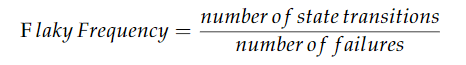
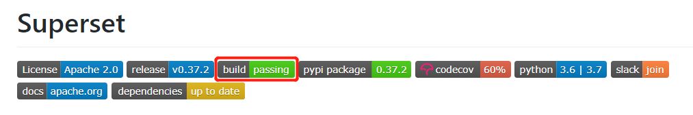
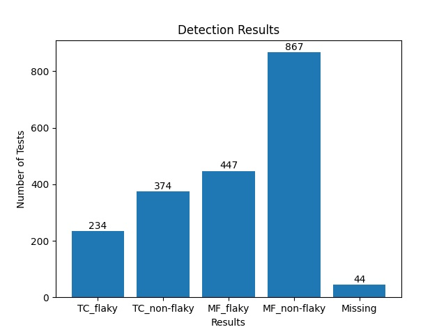
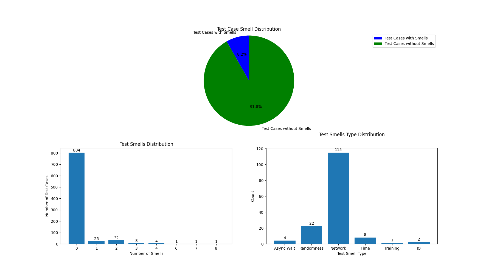
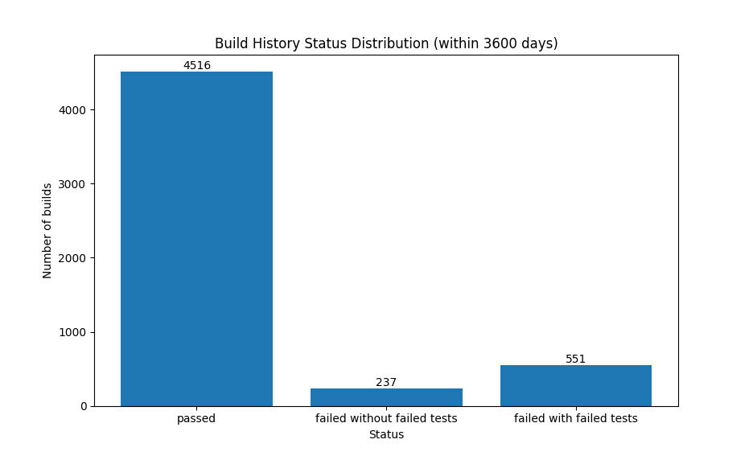
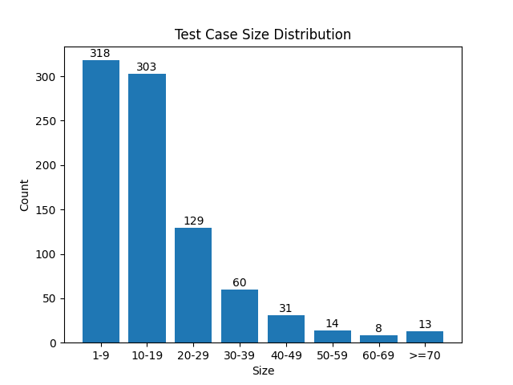

# FlakinessDetector
## Workflow
 
## Traceback Coverage Detection
   If the previous state of a failed test is passed this tool will use traceback overage to detect flaky tests.
   
   This tool will mark a failed test(previous passed) as flaky if the traceback didn't cover the changes,
   otherwise, mark the test as non-flaky.
## Multi-factor Detection
   If the previous state of a failed test is not passed, this tool will use multi-factor to detect flaky tests.
   
   This tool used 4 factors as input to train a KNN model, then use this model to detect flaky tests
   
   **4 factors**:
   
   *traceback coverage*: whether traceback covers changes.
   
   *flakiness-inducing test smell*: test smell that may cause test flaky.
   
   *flakiness frequency*:  the number of state transitions of a test divides it's number of failures
   
    
   
   *test size*: the number of uncommented source code lines for a test method.
   
## 1.Requirements
### Language:
   python>=3.6.7
### Dependency:
    matplotlib==3.3.2
    numpy==1.19.2
    prettytable==1.0.0
    PyMySQL==0.10.1
    pandas==1.1.4
    click==7.1.2
    seaborn==0.11.0
    requests==2.24.0
    scikit_learn==0.23.2
## 2.Use
### 2.1 Install
    pip install -r requirements.txt
### 2.2 setup mysql
#### 2.2.1 create mysql database
   Create a database (with any name) in mysql to save data
#### 2.2.2 change connection info
   Change host,user,password(pw),database(db) in F_Detector/mysql_handler.py file to connect your mysql. For example, update the line - connect(host="localhost", user="username", pw="password", db="The name you selected in 2.2.1")
      
#### 2.2.3 Clone Project Under Test
   Clone a project under test, example: git clone https://github.com/apache/incubator-superset.git 
#### 2.2.4 add github token
   Change the global variable "token" in F_Detector/changes_github.py file, change it to your own github token
   
   We need github token because this tool needs to get changes from github using github API, you can only call the API 50 times within one hour if you don't set a 
   token
#### 2.2.5 add training dataset
   Multi-factor detection method needs dataset to train a KNN model, the training dataset 
   should be named as "dataset.csv" and put it in F_Detector directory.
   
   dataset.csv format:
   
    [Test Name, Build ID, Flaky Frequency, Traceback Coverage, Number of Test Smells, Previous State, Test Size, Flaky or Not]
### 2.3 Two ways to load build history
Two of the factors, in this tool, depend on build history. This project facilitates users to load history either from Travis or by manually assigning the JSON file.  
####  2.3.1 Download and Process Build Logs from Travis CI
The Travis build logs of the projects can be accessed through GitHub project. For example, if you visit "https://github.com/apache/incubator-superset" page, you will find  . Click here and it will take you to the build history. The following commands load it automatically.

      command: python initialize.py --i init --p [project_under_test_path] --o [project_under_test_owner] --n [project_under_test_name] --l [NumberOfDays]
      
      --p: project under test local path
      --o: project under test owner on github
      --n: project under test name on github
      --l: opptional, build history in the past [NumberOfDays] days (for example, 180, 365) you want to get from Travis CI, default:0, get all the build history

For example, in the URL: https://github.com/apache/incubator-superset, the project owner is "apache", the project name is "incubator-superset" and local path could be where you cloned the project. 

Note: use "python initialize.py --help" to get details of this command

#### 2.3.2 Init from Json file

      command: python initialize.py --i init_json --p [project_under_test_path] --j [json_file_path]
      
      --p: project under test local path
      --j: path of build hisory json file, only need the name of the json file if the json file is in current dictory

The structure of JSON file is as follows:

    <String: build id>: { 
            "branch_name": <String: branch name>,
            "id": <Integer: build id>,
            "state": <String: build status(passed,failed)>,
            "previous_state": <String: build status of the parent commit of this commit>,
            "commit_sha": <String: commit SHA>,
            "duration": <Integer: how long it takes to finish this build(seconds)>,
            "finished_at": <String: when the build finished at>,
            "failed_info": {  <Dict: it contains the info of failed tests, can be null>
                "commit_sha": <String: commit SHA>,
                "branch": <String: branch name>,
                "build_id": <Integer: build id>,
                "compare_url": <String: compare url of the commit>,
                "slug": <String: slug of the project>,
                "failed_tests": [ <List: it contains multiple Dicts,each Dict contains info of one failed test>
                    {   <Dict: it conatins basic info of each failed test>
                        "test_case": <String: test case name>,
                        "test_class": <String: class of the test case, can be null>,
                        "test_file": <Srting: which test file the test case belong to>,
                        "test_dir": <String: relative directory of the test file>
                    }
                ],
                "traceback": { <Dict: it contains traceback of each failed test, can be null>
                    <String: test case name>: [  <List: it contains detail info of traceback of each failed test>
                        [   <List: it contains 3 main info of traceback>
                            <String: file path>,
                            <String: The line number where the following code is>,
                            <String: the code that caused the test to fail>
                        ], 
                    ]
                }
            }
        }
 JSON example:
 
    "651170777": {
        "branch_name": "master",
        "id": 651170777,
        "state": "passed",
        "previous_state": "passed",
        "commit_sha": "541acfba360202e8a1b6eae4234f2ff833652ae0",
        "duration": 417,
        "finished_at": "2020-02-16T17:59:59Z",
        "failed_info": {}
    },
    "651505159": {
        "branch_name": "master",
        "id": 651505159,
        "state": "failed",
        "previous_state": "passed",
        "commit_sha": "5db3258483e3478ddf6ee89b30f4d3cfe9927d3b",
        "duration": 409,
        "finished_at": "2020-02-17T13:35:42Z",
        "failed_info": {
            "commit_sha": "5db3258483e3478ddf6ee89b30f4d3cfe9927d3b",
            "branch": "master",
            "build_id": 651505159,
            "compare_url": "https://github.com/explosion/spaCy/pull/5026",
            "slug": "explosion/spaCy",
            "failed_tests": [
                {
                    "test_case": "test_serialize_custom_tokenizer",
                    "test_file": "test_serialize_tokenizer.py",
                    "test_class": "NULL",
                    "test_dir": "spaCy/spacy/tests/serialize/"
                }
            ],
            "traceback": {
                "test_serialize_custom_tokenizer": [
                    [
                        "/home/travis/build/explosion/spaCy/spacy/tests/serialize/test_serialize_tokenizer.py",
                        "22",
                        "test_serialize_custom_tokenizer"
                    ],
                    [
                        "tokenizer.pyx",
                        "572",
                        "spacy.tokenizer.Tokenizer.from_bytes"
                    ],
                    [
                        "/home/travis/virtualenv/python2.7.14/lib/python2.7/re.py",
                        "194",
                        "compile"
                    ],
                    [
                        "/home/travis/virtualenv/python2.7.14/lib/python2.7/re.py",
                        "247",
                        "_compile"
                    ]
                ]
            }
        }
    }
#### 2.3.3 Convert build history on Travis CI to json file
   This tool allow us automatically convert build history on Travis CI to json file.
   
    command: python initialize.py --i builds2json -- o [project_under_test_owner] --n [project_under_test_name] --l [NumberOfDays]
    --o: project under test owner on github
    --n: project under test name on github
    --l: opptional, build history in the past [NumberOfDays] days (for example, 180, 365) you want to get from Travis CI, default:0, get all the build history

### 2.4 Generate Output in Tables and Graphs
   There are 2 ways to show data: charts and tables. 
   Tables provide detailed information including test case names, paths, name of test smells and other information whereas charts provides high level quantitative information.
   Every table will be saved as a csv file to output/csv and every chart will be saved as a image to output/image
   use "python show.py --help" to get details

#### 2.4.1 show detection results

get detection results and other info of one build

        command: python show.py --type results_id --id [build id]
        output: table ['Build ID', 'Test Name', 'Flaky or Not', 'Detection Method', 'Traceback Cover', 'Number of Smells', 'Flaky Frequency', 'Size', 'Path']
        
get detection results and other info of a test.

        command: python show.py --type results_test --test [test name]
        
        output: table ['Build ID', 'Test Name', 'Flaky or Not', 'Detection Method', 'Traceback Cover', 'Number of Smells', 'Flaky Frequency', 'Size', 'Path']
        
        
get all detection results and other info
        
        command: python show.py --type results
        
        output: 1. table ['Build ID', 'Test Name', 'Flaky or Not', 'Detection Method', 'Traceback Cover', 'Number of Smells', 'Flaky Frequency', 'Size', 'Path']
                2. chart
   example output:
   
   **TC_flaky**: number of tests marked as flaky by traceback coverage detection method
   
   **TC_non-flaky**: number of tests marked as non-flaky by traceback coverage detection method
   
   **MF_flaky**: number of tests marked as flaky by multi-factor detection  method
   
   **MF_non-flaky**: number of tests marked as non-flaky by multi-factor detection method
   
   **Missing**: number of tests missing factors(size and smells), because unable to checkout the commit
    
   

#### 2.4.2 show tests marked as flaky by this tool
   Use the following command to check tests marked as flaky by this tool
   
    command: python show.py --type flaky
    output: table ['Build ID', 'Test Name', 'Flaky or Not', 'Detection Method', 'Number of Smells', 'Flaky Frequency', 'Size', 'Path']
#### 2.4.3 test smells

##### (1) show test smells distribution
      command: python show.py --type smell
      output: 1. table ['Test Name', 'Number of Smells', 'Path']
              2. 3 charts
   example output:
   
##### (2) show test smell details

      command: python show.py --type smell_details 

 The above command will provides information for all test cases. In case, you want to limit to one specific test case, run the following command:

      command: python show.py --type smell_details --test [Test Name]
      
      output: table ['Test Name', 'Number of Smells', 'Smell type', 'Tip', 'Location', 'Path']

#### 2.4.4 traceback coverage (Think about other name -- I will also think)

show latest failed build with failed tests: 

      command: python show.py --type tc_one
      
show dependency coverage of a certain build:

      command: python show.py --type tc_one --id [build id]
      
      output: a table ['Failed Test', 'Coverage status', 'Build ID', 'Build Finished Time', 'Path']

The below command used all build history from DB.

      command: python show.py --type tc_all 
      
      output: table ['Failed Test', 'NT-FDUC', 'Path', 'Last Failed Build ID']
      
      note: NT-FDUC = Number of Times, It failed due to unrelated changes in past
   
If you want to limit the number of days, use the following command:

      command: python show.py --type dc_all --days [Number Of Days]

       output: table ['Failed Test', 'NT-FDUC', 'Path', 'Last Failed Build ID']

#### 2.4.5 test history

show test failed history:

        command: python show.py --type test_history --days [NumberOfDays] 
        
        --days is opptional, days means get the data generated whin X days; default 3600
        
        output: 1. table ['Failed Test', 'Failed Times', 'Path']
       
                2. chart
   example output:
   
   
#### 2.4.6 test size
##### (1) show test size distribution
      command: python show.py --type size
      
   example output:
   
##### (2) show tests that their size bigger than x
      command: python show.py --type size_bigger_than --size [x]
      
      output: a table ['Test Name', 'Path', 'Size']
##### (3) show test size between x and y
      command: python show.py --type size_between --between [x] [y]
      
      output: a table ['Test Name', 'Path', 'Size', 'Test Smells']

### 2.5 Update Data
#### 2.5.1 update build history from Travis CI
   Use the following command to keep the build history up to date.
    
    command: python update.py --update travis --p [project path] --o [project owner] --n [project name]
#### 2.5.2 update build history from json file
   Use the following command to update build history from json file.
    
    command: python update.py --update json --p [project path] --j [json file path]
#### 2.5.3 update training dataset
   Use the following command to update training dataset, when you confirm that a failed test is flaky or non-flaky,
   you can add this test to training dataset.
    
    command: python update.py --update data --id [build id] --test [test name] --label [1 or 0; 1 means flaky, 0 means non-flaky]
#### 2.5.4 update multi-factor detection results
   You need to update multi-factor detection results after updating the training dataset,
   use the following command to update the results.
   
    command: python update.py --update results