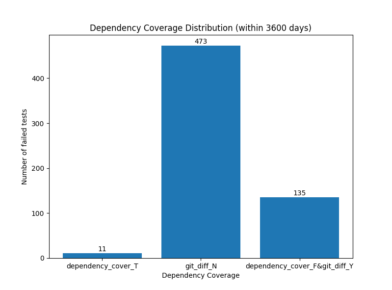
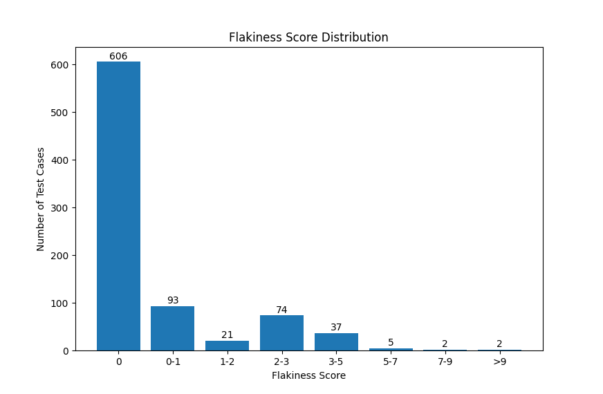

# FlakinessDetector
## 1.Requirements
### Language:
   python>=3.6.7
### Dependency:
    click==7.1.2
    matplotlib==3.3.2
    prettytable==1.0.0
    PyMySQL==0.10.1
    pytest==5.3.5
    requests==2.23.0
## 2.Use
### 2.1 Install
    pip install -r requirements.txt
### 2.2 setup mysql
#### 2.2.1 create mysql database
   Create a database (with any name) in mysql to save data
#### 2.2.2 change connection info
   Change host,user,password(pw),database(db) in mysql_handler.py file to connect your mysql. For example, update the line - connect(host="localhost", user="username", pw="password", db="The name you selected in 2.2.1")
      
#### 2.2.3 Clone Project Under Test
   Clone a project under test, example: git clone https://github.com/apache/incubator-superset.git 

### 2.3 Two ways to load build history
Two of the factors, in this tool, depend on build history. This project facilitates users to load history either from Travis or by manually assigning the JSON file.  
####  2.3.1 Download and Process Build Logs from Travis CI
The Travis build logs of the projects can be accessed through GitHub project. For example, if you visit "https://github.com/apache/incubator-superset" page, you will find  . Click here and it will take you to the build history. The following commands load it automatically.

      command: python initialize.py --i init --p [project_under_test_path] --o [project_under_test_owner] --n [project_under_test_name] --l [limit]
      
      --p: project under test local path
      --o: project under test owner on github
      --n: project under test name on github
      --l: opptional, build history in the past [limit] days you want to get from Travis CI, default:0, get all the build history

For example, in the URL: https://github.com/apache/incubator-superset, the project owner is "apache", the project name is "incubator-superset" and local path could be where you cloned the project. 

Note: use "python initialize.py --help" to get details of this command

#### 2.3.2 Init from Json file
      command: python initialize.py --i init_json --p [project_under_test_path] --j [json_file_path]
      
      --p: project under test local path
      --j: path of build hisory json file, only need the name of the json file if the json file is in current dictory

The structure of JSON file is as follows:

***************PLEASE PROVIDE THE STRUCTURE ***************
### 2.4 Generate Output in Tables and Graphs
    There are 2 ways to show data: charts and tables. Tables provide detailed information including test case names, paths, name of test smells and other information whereas charts provides high level quantitative information (*****UPDATE IT AS YOU WANT*********).

    use "python show.py --help" to get details

#### 2.4.1 test smells
##### (1) show test smells distribution
      command: python show.py --type test_smell
      ********* It should be CSV FIles. All taales should be in CSV files, create a special folder with name OutPUT **************
      ******** Double Check the NUMBER of test Smells in both Grapgs***************
      output: 1. table ['Test Case', 'Path', 'Number of Smells']
              2. 3 charts
   example output:
   
##### (2) show test smell details

      command: python show.py --type smell_details 

 The above command will provides information for all test cases. In case, you want to limit to one speciofic test case, run the following command:

      command: python show.py --type smell_details --test_case TestCaseName

      ****** Generate CSV File *******
      
      output: table ['Test Case', 'Number of Smells', 'Smell type', 'Tip', 'Location', 'Path']

#### 2.4.2 dependency coverage (Think about other name -- I will also think)
***** YOU SHOULD HAVE TWO COMMANDS. ONE COMMAND GIVES RESULTS ABOUT THE TEST CASES THAT WERE FAILED IN THE LAST/LATEST BUILD ONLY. May be you can pass the parameter as "--days" where "0" means last failed build, "leaving it empty" means alll failed builds or "Any Number" means days.************** 

For example:

below is a correct table:
*********Failed Test Case Name - Coveragge Status (0 for failed with related changes and 1 for failed with unrelated changes) - Latest BuildID********

      command: python show.py --type dependency_cover 
   
   The above command used all build history from DB. If you want to limit the number of days, use the following command:

      command: python show.py --type dependency_cover --days NumberOfDays
       ******UPDATE THE FOLLOWING COLUMN NAME IN THE FILE  AND GENRATE THE CSV FILE ************
       output: 1. table ['Failed Test Case Name', 'Number of Times, the TC failed due to unrelated changes', 'Path', 'Last Failed Build ID'] ** look above ***
               2. chart
                  dependency_cover_T: test case failed and the traceback covered code changes
                  git_diff_N: can not get code changes from github, corrasponding dependency_cover is F(False)
                  dependency_cover_F&git_diff_Y: traceback did not cover code changes and successfully got code changes from github
   example output:
    . . **** No Graph ******

#### 2.4.3 Test case history

**** We need two tables so does two commands. One tables should only present test cases failed in the last build. The other table should present all test cases in the repo.****

 *********output: 1. table ['Failed Test Name', 'Number of Times, It failed due to unrelated changes in past', 'Path']**********

 One command only give information of test cases from the last failed build in NumberOfDays (whatever user enter), other command give information of all test cases in repo in NumberOfDays (whatever user enter)

        command: python show.py --type build_history --days NumberOfDays . . *** can we rename "build_histroy" tp "testcase_history"
        
        --days is opptional, days means get the data generated whin X days; default 3600
        
       
                2. chart
   example output:
   
   
#### 2.4.1 test case size
##### (1) show test case size distribution
      command: python show.py --type size
      
   example output:
   
##### (2) show test cases that their size bigger than x
      command: python show.py --type size_bigger_than --size [x]
      
      output: a table ['Test Case', 'Path', 'Size']
##### (3) show size between x and y
      command: python show.py --type size_between --between [x] [y]
      
      output: a table ['Test Case', 'Path', 'Size', 'Test Smells']

#### 2.4.5 flakiness score
        command: python show.py --type flakiness_score
        
        How to get flakiness score:
            score = falied_times*0.2 + (size > 30 ?size - 29 : 0) * 0.05
                    + test_smell_numver * 0.4 + (dependency_cover == 'F'?2 : 0)
        output: 1. table ['Test Case', 'Score', 'Failed Times', 'Size', 'Number of Test Smells', 'Recent Dependency Cover', 'Path']
                2. chart
   example output:
       